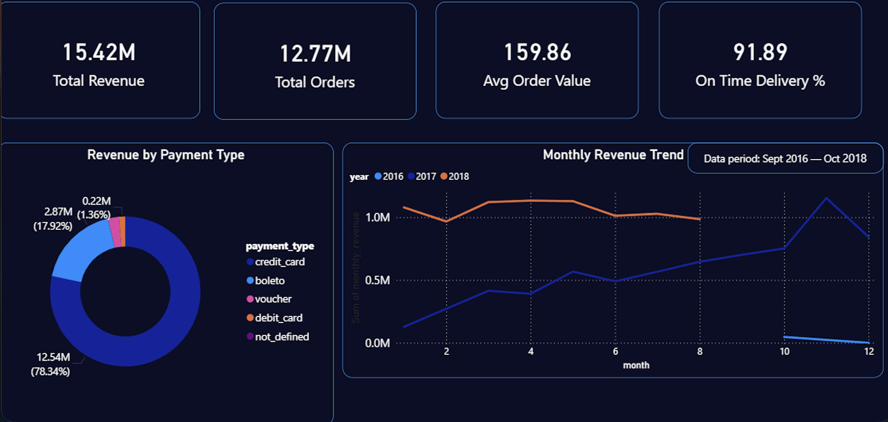

# eCommerce Sales Data Analysis

## SQL + Python + Power BI

## Project Overview

End-to-end e-commerce analytics project
analyzing 99K orders worth R$16M revenue
using MySQL, Python and Power BI.

## Tools Used

- MySQL — 25 complex SQL queries
- Python — EDA with Pandas, Matplotlib, Seaborn
- Power BI — 5 page interactive dashboard

## Dataset

- Source: Olist Brazilian E-Commerce (Kaggle)
- Orders: 99,440
- Revenue: R$16,008,872
- Period: 2016 — 2018

## Key Findings

- Top Category: Bed & Bath
- Peak Month: November 2017 (Black Friday)
- On Time Delivery: 91.89%
- Avg Review Score: 4.09/5
- Customer LTV: R$159.86
- Top Payment: Credit Card (78%)
- Top State: São Paulo

## Business Recommendations

1. Launch loyalty program — 99% one time buyers
2. Double marketing budget for Black Friday
3. Fix January delivery delays
4. Improve delivery to RR state
5. Focus inventory on Bed & Bath category

## Python EDA Plots

## Dashboard Screenshots

### Revenue overview

### Product analysis

### Customer insights

### Delivery Satisfaction

### Growth Trends

## Author

**Devanshu**

- GitHub: github.com/devanshu1513
