# E-Commerce Sales Intelligence & Predictive Analytics

### SQL + Python + Machine Learning + Power BI + Tableau

An end-to-end e-commerce analytics and predictive modeling project using SQL, Python, Machine Learning, Power BI, and Tableau to analyze sales performance, customer behavior, product categories, payment methods, delivery satisfaction, and operational delivery risk.

The project extends traditional business intelligence with machine learning-based late-delivery prediction and statistical analysis to generate actionable business insights.

## Project Objectives

- Analyze overall revenue and sales trends
- Identify high-performing product categories
- Understand customer purchasing behavior
- Analyze payment methods and order patterns
- Evaluate delivery performance and customer satisfaction
- Identify high-risk delivery orders using Machine Learning
- Analyze delivery risk across customer-seller routes
- Statistically evaluate the relationship between delivery delays and customer reviews
- Build interactive dashboards for business reporting and predictive analytics

## Tools & Technologies

- **MySQL** — SQL analysis, joins, aggregations, CTEs, and window functions
- **Python** — Pandas, NumPy, Matplotlib, and Seaborn
- **Scikit-learn** — Machine Learning and model evaluation
- **Power BI** — Interactive business dashboards and reporting
- **Tableau** — Predictive analytics and operational risk dashboard
- **Jupyter Notebook** — Exploratory data analysis and Machine Learning
- **Git & GitHub** — Version control and project management

## Dataset

The analysis uses the **Brazilian E-Commerce Public Dataset by Olist**, containing anonymized information about orders, customers, products, sellers, payments, and reviews.

- **Orders:** 99,440
- **Period:** 2016–2018
- **Dataset:** Olist Brazilian E-Commerce Dataset
- **Source:** Brazilian E-Commerce Public Dataset by Olist

## SQL Analysis

The SQL analysis is organized into five sections.

### 1. Revenue Analysis

- Monthly revenue trends
- Revenue growth
- Cumulative revenue
- Sales performance
- Revenue comparisons

### 2. Product Analysis

- Category-level revenue
- Top-performing product categories
- Product performance
- Top sellers
- Category contribution to overall revenue

### 3. Customer Analysis

- Customer distribution
- Customer type analysis
- State-wise customer analysis
- Customer purchasing behavior
- Customer-level revenue insights

### 4. Delivery & Satisfaction

- Delivery performance
- Delivery status analysis
- Review score analysis
- Delivery satisfaction
- Relationship between delivery performance and customer reviews

### 5. Advanced Analytics

- Common Table Expressions (CTEs)
- Window functions
- Ranking
- Comparative analysis
- Growth analysis
- Cumulative metrics

## Python EDA

Python was used to perform exploratory data analysis and visualize important business patterns using Pandas, Matplotlib, and Seaborn.

### Visualizations

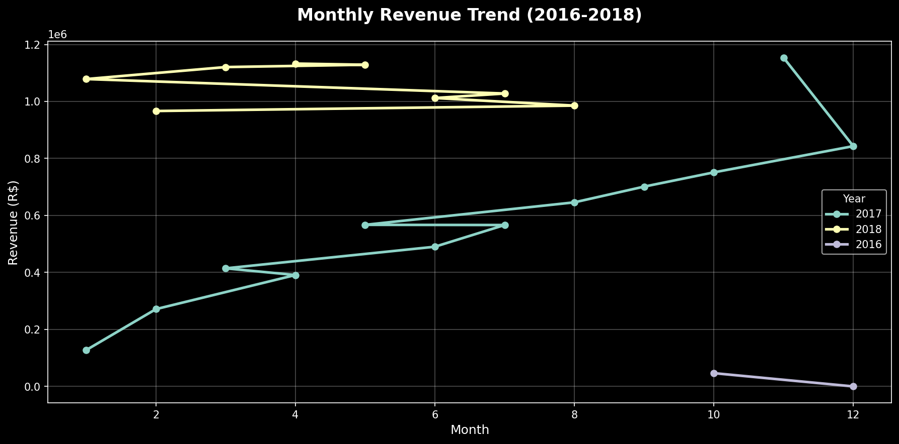

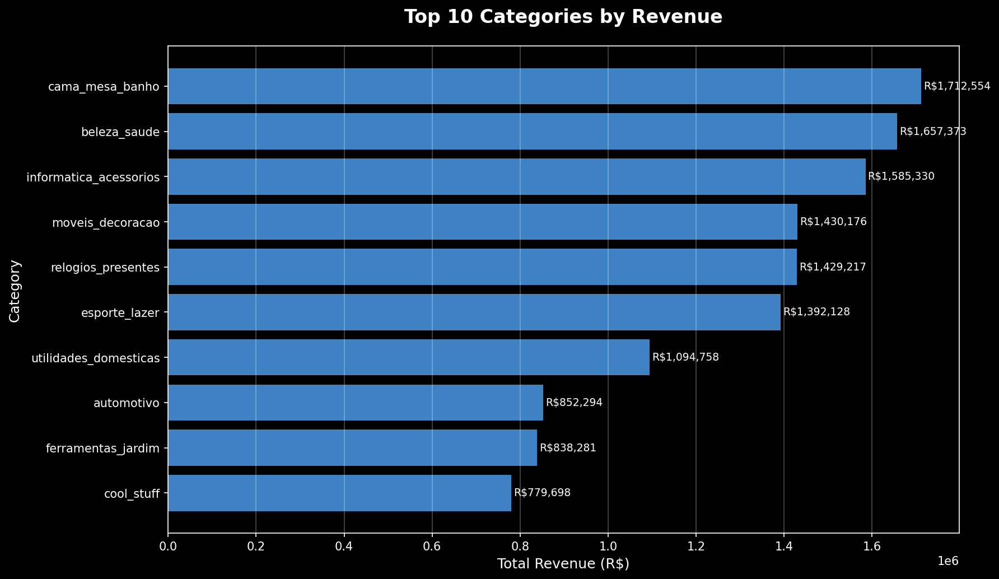

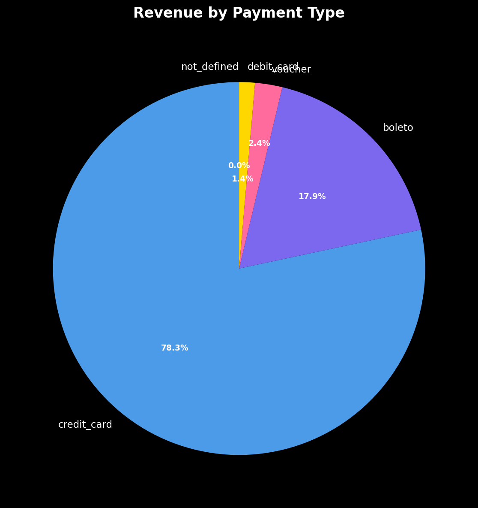

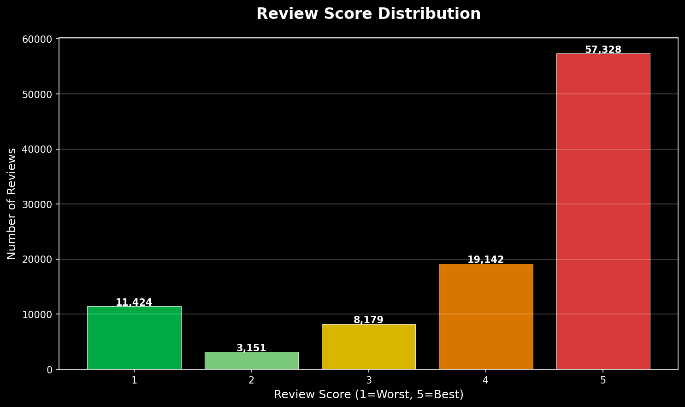

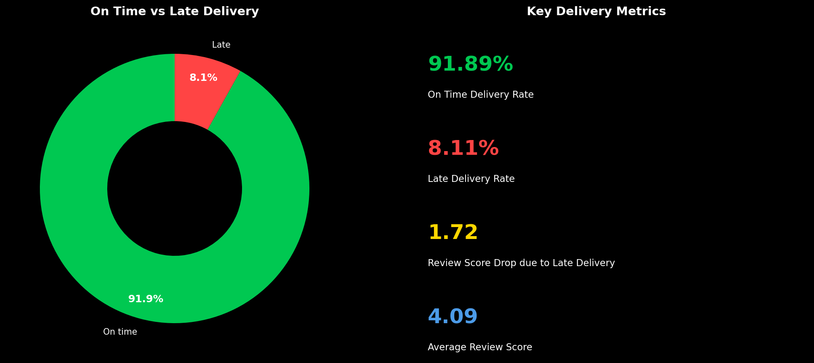

## Machine Learning — Late Delivery Prediction

Machine Learning was added to predict whether an order is likely to be delivered later than its estimated delivery date.

### Target Variable

An order was classified as a **late delivery** when:

```text
Actual delivery date > Estimated delivery date
```

Post-delivery information such as actual delivery date, estimated delivery date, reviews, and other leakage-prone variables were excluded from the predictive features.

### Features Used

The model uses information available around the time of order processing, including:

- Item count
- Total product price
- Total freight value
- Average item price
- Total payment value
- Maximum payment installments
- Payment type
- Customer state
- Seller state
- Seller count
- Purchase year
- Purchase month
- Purchase day of week
- Purchase hour
- Weekend indicator

### Models

Two classification models were evaluated:

1. **Logistic Regression**
2. **Random Forest**

### Model Performance

| Model               |  Accuracy |   ROC-AUC | Late Precision | Late Recall |   Late F1 |
| :------------------ | --------: | --------: | -------------: | ----------: | --------: |
| Logistic Regression |     0.646 |     0.647 |          0.122 |       0.545 |     0.200 |
| **Random Forest**   | **0.844** | **0.736** |      **0.238** |   **0.419** | **0.304** |

**Random Forest** was selected as the final model based on its stronger ROC-AUC and late-delivery F1-score.

## Classification Threshold Optimization

Because late deliveries are relatively less frequent than on-time deliveries, the default classification threshold of 0.50 resulted in relatively low recall for late orders.

Different probability thresholds were evaluated to find a better balance between precision and recall.

The **0.30 probability threshold** produced the highest F1-score for the late-delivery class.

### Final Random Forest Performance at 0.30 Threshold

- **Accuracy:** 0.844
- **ROC-AUC:** 0.736
- **Late-order Precision:** 0.238
- **Late-order Recall:** 0.419
- **Late-order F1-score:** 0.304

At this threshold:

- **Actual late orders:** 1,565
- **Predicted late orders:** 2,751
- **Late orders correctly identified:** 656
- **Actual late orders detected:** approximately 41.9%

The threshold was selected to improve the model's ability to identify potentially late orders rather than maximizing overall accuracy.

## Feature Importance

Feature importance was analyzed to understand which variables contributed most to the Random Forest predictions.

Important predictive features included:

- Purchase month
- Total freight value
- Total payment value
- Average item price
- Total product price
- Purchase hour
- Purchase day of week
- Payment installments
- Customer state
- Seller state

Feature importance indicates predictive contribution and should not be interpreted as proof of causality.

## Statistical Analysis

A statistical analysis was performed to investigate whether delivery delays were associated with customer review scores.

Because review scores are ordinal and the groups were not assumed to follow a normal distribution, the **Mann–Whitney U test** was used.

### Results

| Metric              | On-Time Orders | Late Orders |
| :------------------ | -------------: | ----------: |
| Mean Review Score   |           4.29 |        2.57 |
| Median Review Score |              5 |           2 |

**Mann–Whitney U test:**

- **U statistic:** 524,650,644
- **p-value:** p < 0.001
- **Rank-biserial correlation:** 0.554

The results indicate a strong statistical association between delivery performance and customer review scores.

Late orders received substantially lower review scores than on-time orders.

This analysis demonstrates association rather than causation.

## Business & Operational Analysis

Route-level delivery performance was analyzed using customer state and seller state.

Routes with fewer than **100 orders** were excluded to reduce the influence of very small samples.

Examples of higher-risk routes included:

- **AL → SP:** 26.3% late
- **SP → MA:** 25.2% late
- **MA → SP:** 21.2% late
- **PI → SP:** 18.2% late
- **RJ → SP:** 15.5% late
- **BA → SP:** 15.0% late

The analysis highlights that delivery risk can vary substantially across geographic routes.

High-volume routes are particularly important because even a moderate late-delivery rate can result in a large absolute number of delayed orders.

## Predictive Delivery Risk Dashboard — Tableau

A dedicated Tableau dashboard was developed to present the Machine Learning predictions and operational delivery insights in an interactive business-reporting format.

The dashboard combines model predictions, delivery-risk segmentation, state-level risk analysis, and route-level delivery performance.

### Dashboard Components

#### 1. Risk Category Distribution

Orders are classified into three risk categories based on the Random Forest predicted probability of late delivery:

- Low Risk
- Medium Risk
- High Risk

The final test dataset contains:

- **Low Risk:** 16,592 orders
- **Medium Risk:** 2,350 orders
- **High Risk:** 352 orders

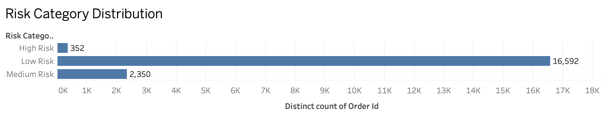

#### 2. Actual vs Predicted Late Orders

Compares actual late orders with orders predicted as late using the optimized **0.30 probability threshold**.

- **Actual late orders:** 1,565
- **Predicted late orders:** 2,751

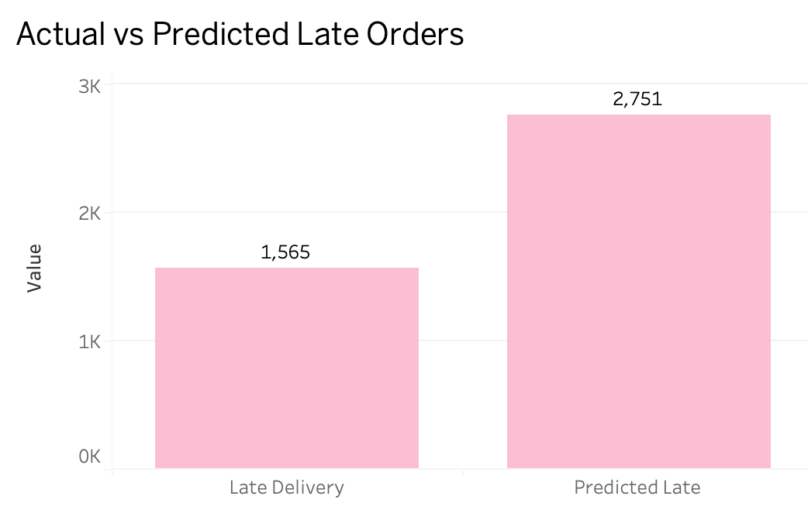

#### 3. High-Risk Orders by Customer State

Identifies customer states with the largest number of orders classified as high risk.

This can help prioritize regions where additional monitoring or operational intervention may be useful.

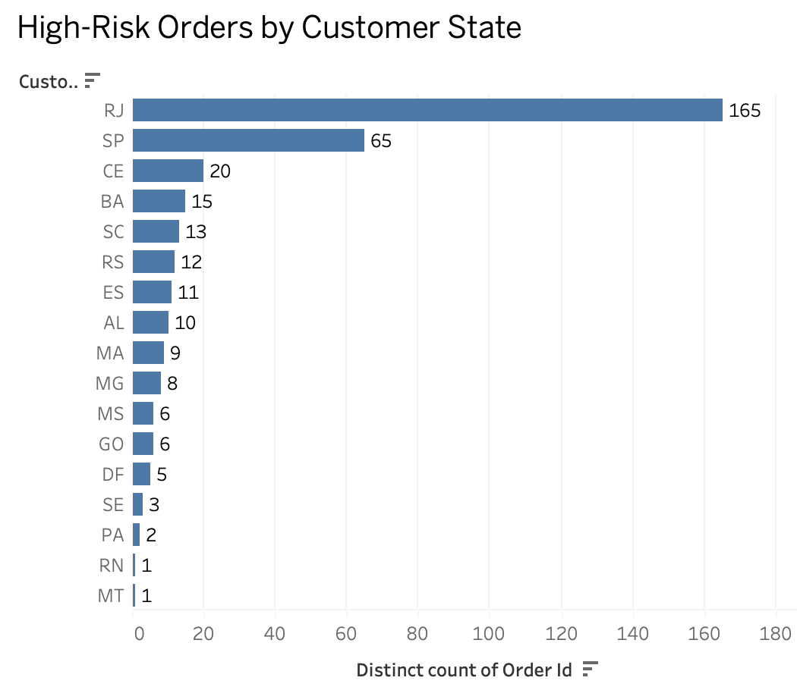

#### 4. Late Delivery Rate by Route

Analyzes customer-state → seller-state routes to identify routes with elevated late-delivery rates.

Routes with fewer than 100 orders were excluded to reduce the effect of very small samples.

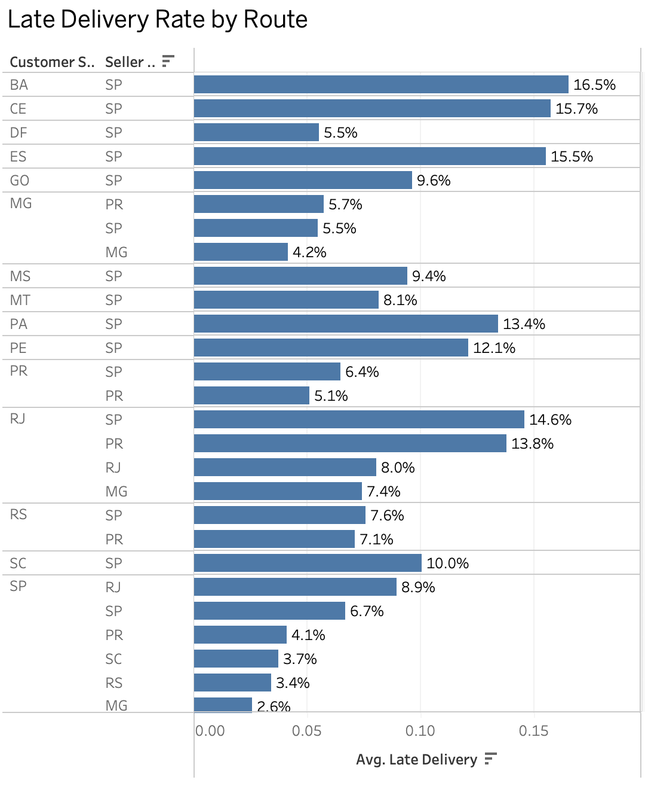

### Model Summary

- **Model:** Random Forest
- **ROC-AUC:** 0.736
- **Late-order F1-score:** 0.304
- **Classification Threshold:** 0.30

### Complete Tableau Dashboard

The complete Tableau dashboard combines all four analytical views into a single interactive dashboard.

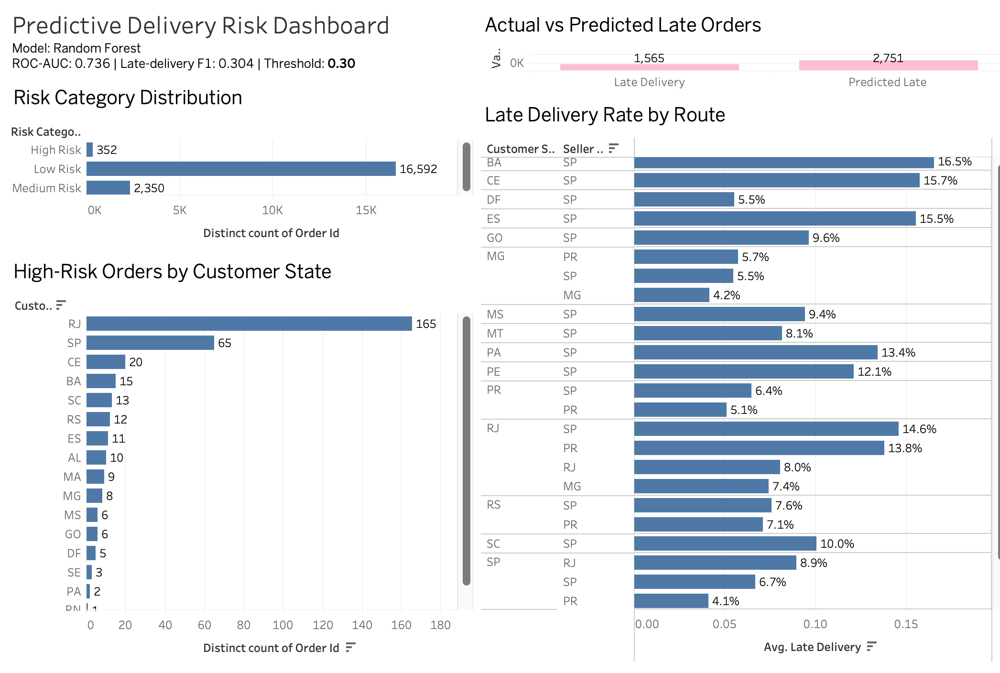

## Power BI Dashboard

The Power BI dashboard contains five analytical sections covering revenue, products, customers, delivery satisfaction, and growth trends.

### Revenue Overview

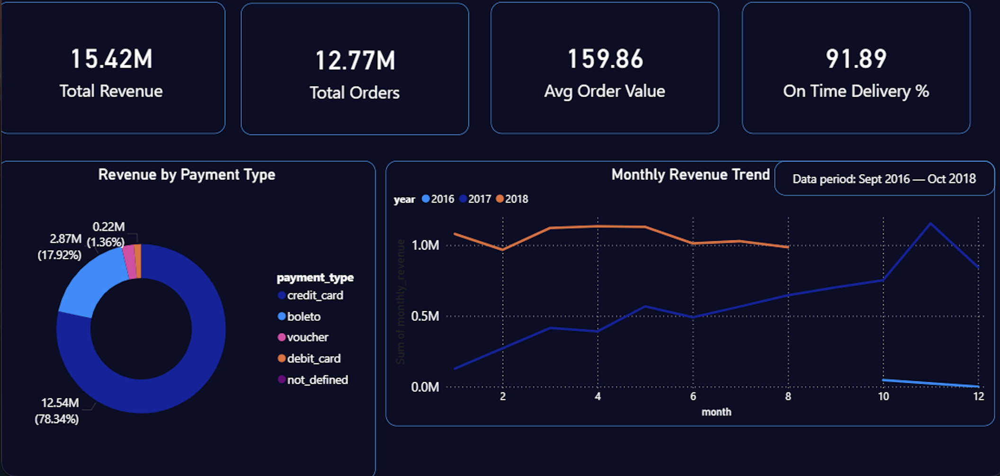

### Product Analysis

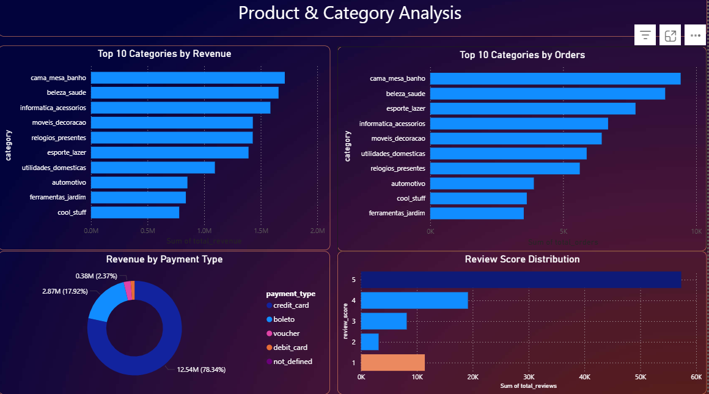

### Customer Insights

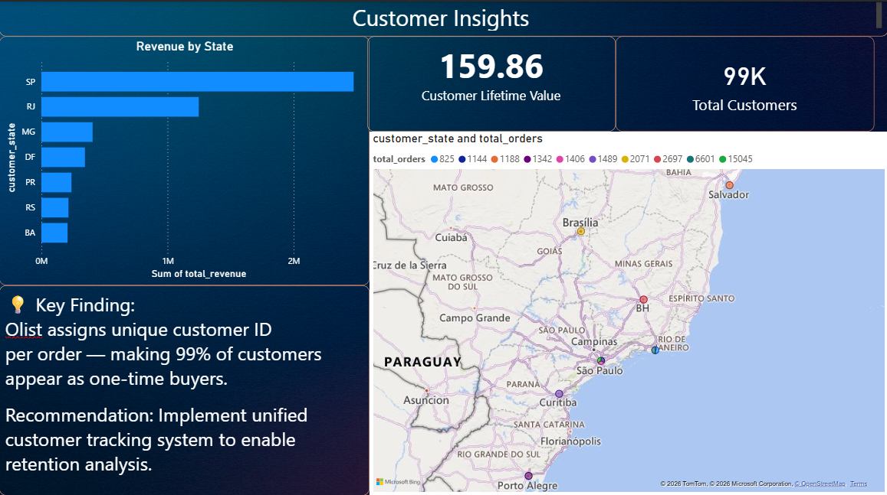

### Delivery & Satisfaction

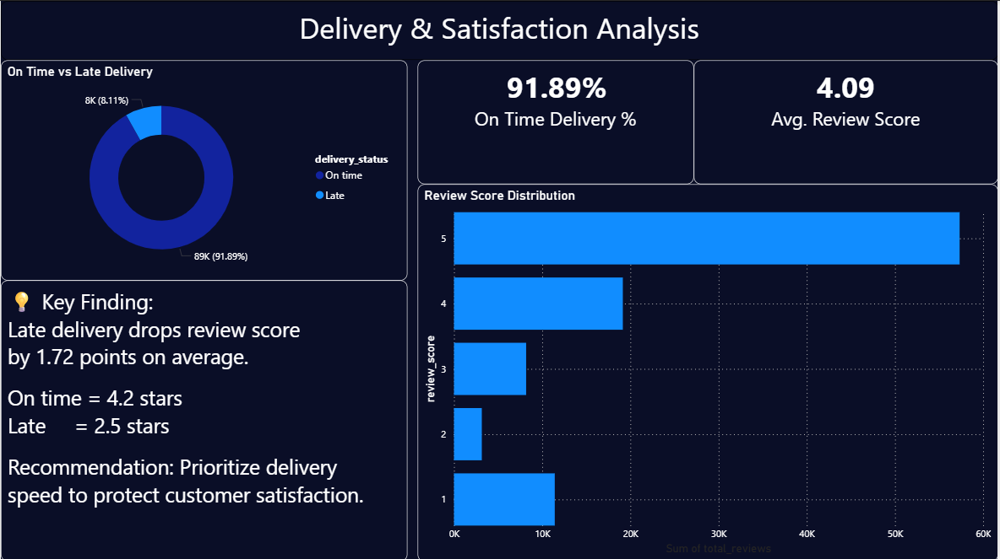

### Growth Trends

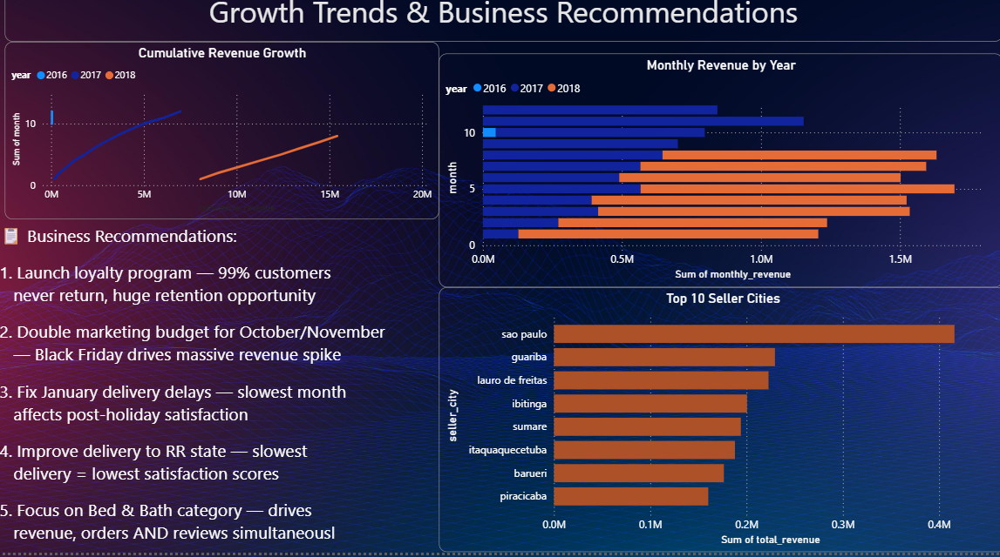

## Key Business Insights

- Bed & Bath was among the highest-revenue product categories.
- November 2017 recorded a significant revenue peak.
- Credit cards represented the dominant payment method.
- São Paulo had the largest customer base among Brazilian states.
- On-time orders received substantially higher review scores than late orders.
- Delivery performance has a strong statistical association with customer satisfaction.
- Delivery risk varies considerably across geographic routes.
- The Random Forest model achieved a **0.736 ROC-AUC** for late-delivery prediction.
- Threshold optimization improved the model's ability to identify potentially late orders.
- Route-level analysis can help prioritize operational monitoring and intervention.

## Project Outputs

### SQL Outputs

- Monthly revenue analysis
- Category revenue analysis
- Customer analysis
- Delivery and satisfaction analysis
- Advanced analytical queries

### Python Outputs

- Revenue trends
- Category analysis
- Payment analysis
- Review score analysis
- Delivery analysis

### Machine Learning Outputs

- Late-delivery prediction model
- Model comparison
- Optimized classification threshold
- Order-level prediction probabilities
- Delivery risk categories
- Feature importance analysis
- Route-level delivery analysis

### BI Outputs

- Power BI business intelligence dashboard
- Tableau predictive delivery risk dashboard

## Project Structure

```text
E-Commerce-Sales-Data-Analysis/
│
├── sql/
│   ├── 01_revenue_analysis.sql
│   ├── 02_product_analysis.sql
│   ├── 03_customer_analysis.sql
│   ├── 04_delivery_satisfaction.sql
│   └── 05_advanced_analytics.sql
│
├── python/
│   ├── olist_eda.ipynb
│   ├── plot1_monthly_revenue.png
│   ├── plot2_category_revenue.png
│   ├── plot3_payment_types.png
│   ├── plot4_review_scores.png
│   └── plot5_delivery_analysis.png
│
├── ml/
│   ├── 01_late_delivery_prediction.ipynb
│   ├── ml_predictions.csv
│   ├── model_comparison.csv
│   └── route_analysis.csv
│
├── output/
│   ├── category_revenue.csv
│   ├── cumulative_revenue.csv
│   ├── customer_by_state.csv
│   ├── customer_type.csv
│   ├── delivery_status.csv
│   ├── monthly_revenue.csv
│   ├── payment_types.csv
│   ├── review_scores.csv
│   └── top_sellers.csv
│
├── tableau/
│   ├── Olist_Predictive_Analytics.twb
│   ├── predictive_dashboard_risk_distribution.png
│   ├── predictive_dashboard_actual_vs_predicted.png
│   ├── predictive_dashboard_high_risk_states.png
│   ├── predictive_dashboard_routes.png
│   └── tableau_predictive_delivery_risk_dashboard.png
│
├── README.md
└── .gitignore
```

## End-to-End Analytical Workflow

```text
Olist E-Commerce Dataset
          │
          ▼
      SQL Analysis
          │
          ▼
  Business Data Extraction
          │
          ▼
      Python EDA
          │
          ▼
  Statistical Analysis
          │
          ▼
Machine Learning Prediction
          │
          ▼
Late Delivery Risk Scoring
          │
          ▼
Route & Operational Analysis
          │
          ▼
Power BI + Tableau Dashboards
          │
          ▼
   Business Insights
```

## Conclusion

This project demonstrates an end-to-end analytical workflow, starting from e-commerce data and progressing through SQL analysis, exploratory data analysis, statistical testing, machine learning, operational analysis, and business intelligence dashboards.

The combination of descriptive analytics and predictive modeling provides both historical business insights and a framework for identifying potentially high-risk deliveries based on order characteristics and operational factors.

## Author

# Devanshu Kumar

B.Tech — Chemical Science and Technology, IIT Patna

- GitHub: github.com/devanshu1513
